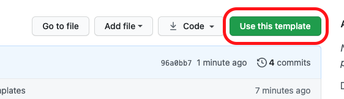
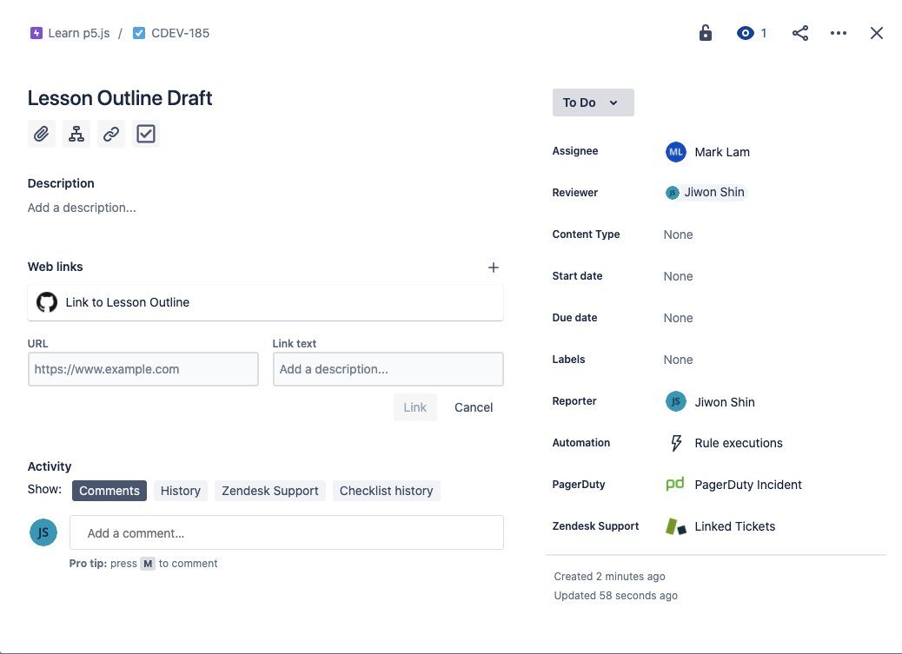
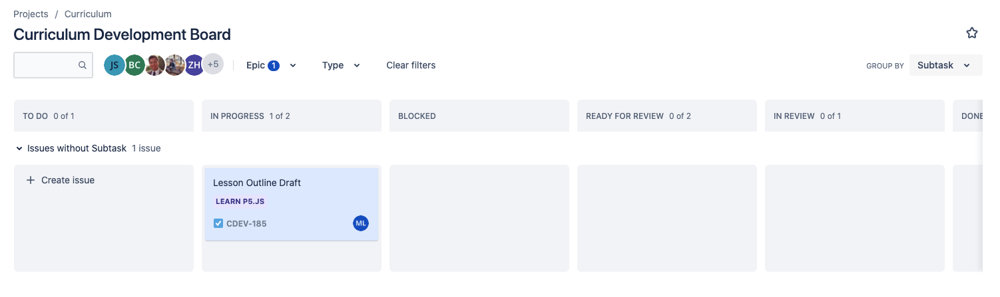

## About this repo:

This repository is set up for an individual contributor to store and manage their drafts for a typical 1-1-1 module (1 lesson, 1 project, 1 quiz). Templates are available for each deliverable in the drafting phase in their respective directory. For example, the template for the outline can be found in the [`/lesson`](lesson/) directory.

When working on a deliverable, you may edit the template directly, however you should remove `-template` from the name.

Additionally, guides for the Author phase of the production cycle are included in the [`/author-guides`](author-guides/) directory.

## Workflow

Copy this template repository by clicking on "Use this template"



Then, create the new repository using the following naming convention: `course-name-module-name`. For example: `learn-javascript-loops`:

## Working on a Deliverable

Create a branch with the current deliverable you are working on. For example: `git checkout -b outline-draft`
```
git checkout -b deliverable
```
You can check which branch you are working on with the following command:
```
git branch
```
*Note that the "master" branch of this repository is called `main`.*

**When starting a new deliverable, make sure to mark it as "In Progress" in Jira.**

## Pushing Code

1. Make sure your local files are up to date with remote origin with the following command:
```
git fetch origin
git merge origin/main
```
If you want to switch branches, you can do it with the following command:
```
git checkout branch_name
```

2. Push your branch after adding & committing your changes:
```
git add .
git commit -m "your commit message here"
git push --set-upstream origin master
```

3. See that in the main repo page, there is a notification to create a pull request. Click "Compare & pull request"


4. Add any notes you have in the pull request comment. Assign your lead Curriculum Developer as a Reviewer. Assign yourself as an Assignee. 


5. You can add comments to specific lines by going to the Files changed tab in the pull request.


## Important Tools
* Each content contributor's production schedule can be found in the Timeline spreadsheet. Also, refer to this spreadsheet for deadlines.
* GitHub repo is where all content lives. Drafts are submitted here as pull requests by content contributors and merged into main branch by CDev. 
  * Raw markdown will be copied into a Google doc for the review/feedback cycle. Resolve all comments/suggestions in the Google Doc before copying the updated draft into Github and moving on to the next deliverable.
  * Jira tickets include any progress-specific comments related to a task.

## General Process
1. Check the timeline spreadsheet for tasks & deadlines.
2. Click on the task name in the timeline spreadsheet for the link to Jira ticket OR find relevant Jira ticket (you should be set as the assignee) on the Kanban board. The relevant file in the GitHub repo will be linked in the Jira ticket.

3. Move ticket from "To Do" to "In Progress" when you start working on the task.

4. When you are done with a draft, or want feedback, create a PR in GitHub and set your Curriculum Developer lead as Reviewer. Also set your Jira ticket status to "Ready for Review".
5. Reviewer will review PR in GitHub and leave comments & feedback in the PR.
6. Reviewer will merge changes.
  * If draft looks good, mark Jira ticket as "Done". Content contributor will move draft to Author.
  * If draft needs further revision, note what needs to be revised in the PR as a comment and mark Jira ticket status to "In Progress". Repeat steps 4 to 6.
7. Tracking all draft & review process in Author remain in Jira.
  * There will be a separate Jira subtask to move draft to Author, and review draft in Author, then CDev will publish when ready.
